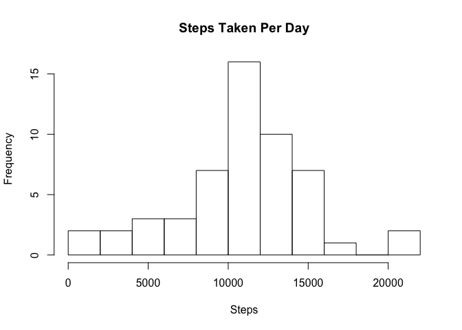
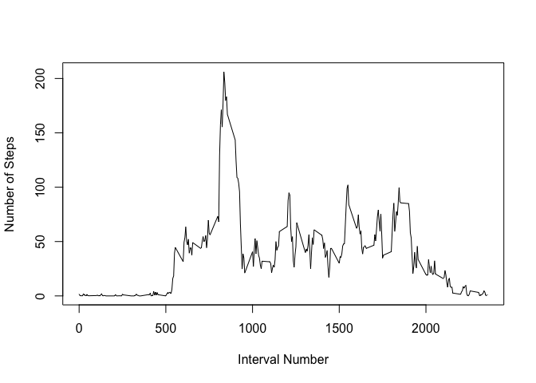
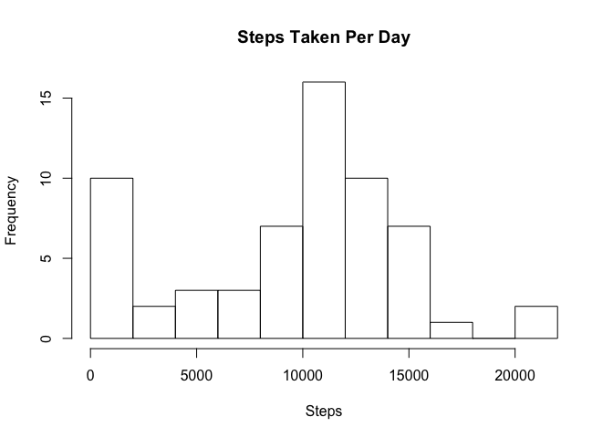
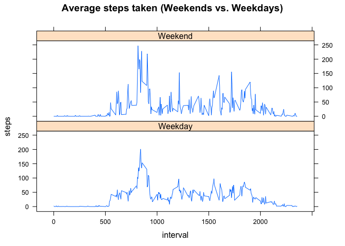

# Reproducible Research: Peer Assessment 1


```
## Loading required package: knitr
```


## Loading and preprocessing the data

We first load the data into a dataframe, careful not to let the dates get turned into factors.


```r
dat<-read.csv("activity.csv",stringsAsFactors=F)
```

We see a sum of steps for each five minute slice of each day over the timeframe Oct 1, 2012 to Nov 30, 2012.

<!-- html table generated in R 3.1.2 by xtable 1.7-4 package -->
<!-- Sun Mar 15 16:09:49 2015 -->
<table border=1>
<tr> <th> steps </th> <th> date </th> <th> interval </th>  </tr>
  <tr> <td align="right">   0 </td> <td> 2012-10-04 </td> <td align="right"> 1115 </td> </tr>
  <tr> <td align="right">   0 </td> <td> 2012-10-04 </td> <td align="right"> 1120 </td> </tr>
  <tr> <td align="right"> 180 </td> <td> 2012-10-04 </td> <td align="right"> 1125 </td> </tr>
  <tr> <td align="right">  21 </td> <td> 2012-10-04 </td> <td align="right"> 1130 </td> </tr>
  <tr> <td align="right">   0 </td> <td> 2012-10-04 </td> <td align="right"> 1135 </td> </tr>
  <tr> <td align="right">   0 </td> <td> 2012-10-04 </td> <td align="right"> 1140 </td> </tr>
   </table>

We need to add a column with a Date format of the character string in date:


```r
dat$timestamp<-as.Date(dat$date)
dat[1000:1005,]
```

```
##      steps       date interval  timestamp
## 1000     0 2012-10-04     1115 2012-10-04
## 1001     0 2012-10-04     1120 2012-10-04
## 1002   180 2012-10-04     1125 2012-10-04
## 1003    21 2012-10-04     1130 2012-10-04
## 1004     0 2012-10-04     1135 2012-10-04
## 1005     0 2012-10-04     1140 2012-10-04
```


## What is mean total number of steps taken per day?

First, we sum each day's steps. This will yield a daily tally of steps taken.


```r
mday<-aggregate(steps ~ timestamp,data=dat,FUN=sum,na.action=NULL)
head(mday)
```

```
##    timestamp steps
## 1 2012-10-01    NA
## 2 2012-10-02   126
## 3 2012-10-03 11352
## 4 2012-10-04 12116
## 5 2012-10-05 13294
## 6 2012-10-06 15420
```

A histogram shows that on most days, the number of steps taken is mostly between 8k and 15k steps.


```r
hist(mday$steps,breaks = 10,xlab = "Steps",main="Steps Taken Per Day")
```

 

We see the mean and median here, disregarding days in which there were no measurements taken. You may also interpolate the data for missing days. Assuming the missing days are characteristic of the other days, you will get the same result.


```r
cat(
    sprintf("Mean steps taken per day: %.1f\n",
            mean(mday$steps[complete.cases(mday$steps)])
            )
    )
```

Mean steps taken per day: 10766.2

```r
cat(
    sprintf("Median steps taken per day: %.1f\n",
            median(mday$steps[complete.cases(mday$steps)])
            )
    )
```

Median steps taken per day: 10765.0

## What is the average daily activity pattern?

First, we aggregate steps by the time of each day using the mean() function.


```r
ms<-aggregate(
    steps ~ interval,
    data=dat,
    FUN=mean
    )
```

Then we see the timeseries by the `interval` variable.


```r
plot(ms$interval,ms$steps,type = "l",xlab = "Interval Number",ylab = "Number of Steps")
```

 

...and find the maximum average slice of the day:


```r
ms[ms$steps==max(ms$steps),"interval"]
```

```
## [1] 835
```

## Imputing missing values


```r
sprintf("five-minute intervals missing (NA) steps: %d out of %d",nrow(dat[is.na(dat$steps),]),nrow(dat))
```

```
## [1] "five-minute intervals missing (NA) steps: 2304 out of 17568"
```

We do a simple fill backward of missing values. In the case we have missing values at the beginning of the dataset (like we do), it's best to fill backward (fromLast). We create a new filled set with dat and then our steps are filled in.


```r
library(zoo)
```

```
## 
## Attaching package: 'zoo'
## 
## The following objects are masked from 'package:base':
## 
##     as.Date, as.Date.numeric
```

```r
filled<-dat
filled$steps<-na.locf(filled$steps,fromLast = T,na.rm = F)
filled$steps<-na.locf(filled$steps,na.rm = F)
```

Histogram of the new data by day. Please note the abundance of 0 days this time is that the NA days from before are now filled in with zeroes.


```r
fday<-aggregate(steps ~ timestamp, data=filled,FUN=sum,na.action=NULL)
hist(fday$steps,breaks=10,xlab = "Steps",main="Steps Taken Per Day")
```

 

...and compare the fday mean and median to the unfilled (mday) data. We clearly see the "filling" of so many zeroes brings down the descriptive qualities of the data.


```r
umean<-mean(mday$steps[complete.cases(mday$steps)])
umed<-median(mday$steps[complete.cases(mday$steps)])

fmean<-mean(fday$steps[complete.cases(fday$steps)])
fmed<-median(fday$steps[complete.cases(fday$steps)])


sprintf("unfilled mean : filled mean     -- %.2f : %.2f",umean,fmean)
```

[1] "unfilled mean : filled mean     -- 10766.19 : 9354.23"

```r
sprintf("unfilled median : filled median -- %.2f : %.2f",umed,fmed)
```

[1] "unfilled median : filled median -- 10765.00 : 10395.00"


## Are there differences in activity patterns between weekdays and weekends?

Create a new variable, weekday or weekend based on the date. We'll use the filled data for this one.

We need a new discriminating factor we'll call wewd (weekend/weekday).


```r
filled$dow<-weekdays(fday$timestamp)
filled$wewd[filled$dow %in% c("Saturday","Sunday")]<-"Weekend"
filled$wewd[filled$dow %in% c("Monday","Tuesday","Wednesday","Thursday","Friday")]<-"Weekday"
```

We then aggregate the steps across the 5-min interval and we/wd factor.

```r
fs<-aggregate(
    steps ~ interval + wewd,
    data=filled,
    FUN=mean
    )
```

...and plot.


```r
library(lattice)
xyplot(steps ~ interval | wewd, data=fs, layout=c(1,2),type = 'l')
```

 


